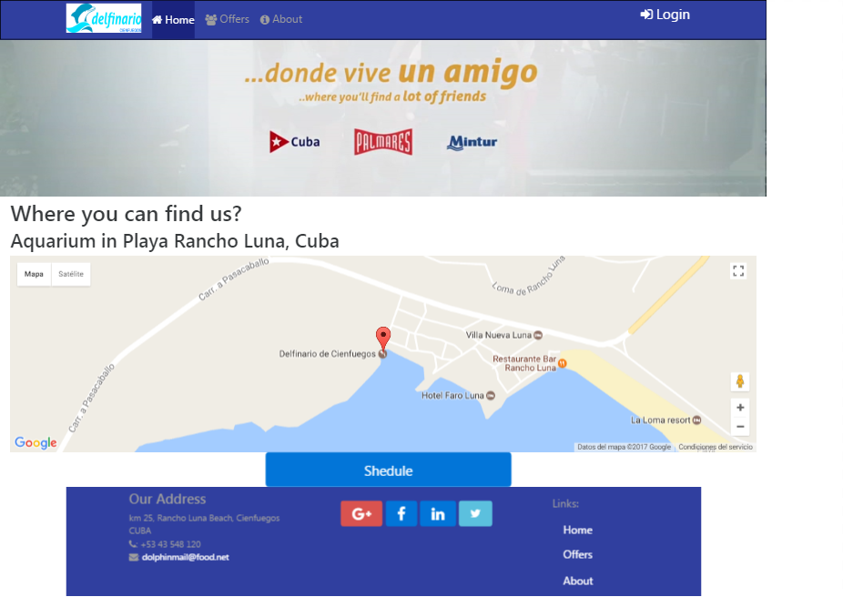

|**title**|**description**|
|:-:|:-:|
|Delphinarium|This is Bootstrap 4 front-end example with a great part of all JS functionalities of it.|

|**Chrome**|**Firefox**|
|:-:|:-:|
|work|work|

# Table of contents
* [Screenshots](#screenshots)
* [Installation](#installation)
* [Knowledge](#knowledge)
* [Contact](#contact)

## Screenshots 

	### Full Screen Views

### Middle Screen View

### Mobile Screen View

## Installation
This requires just a browser and activate js scripts in your browser

## Knowledge

> In ***Langueges:*** `Less`, `CSS`, `JavaScript` and `JQuery`. 

## Contact

* Linkedin: [**Gabriel**](https://www.linkedin.com/in/gabriel-pedraza-b9b0a6b8/)

